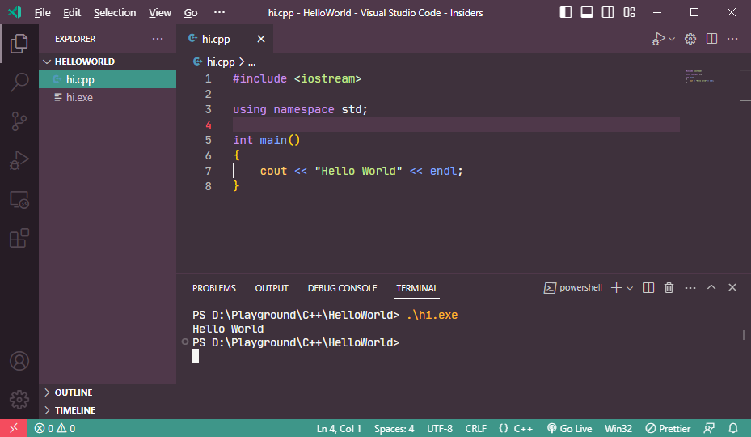
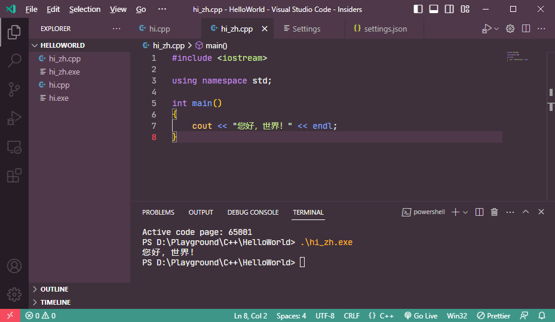

# Data-Structures-2017

## 《[数据结构教程（第二版）](https://item.jd.com/12180519.html)》

王少波，张志 编著

2017年10月第2版


## 声明

这里绝大多数代码都是 GPT-4 写的。这些代码有个优点就是让人一看就明白，可是呢，它们跟书上的原版代码有些不同。大家在用学习或者参考代码的时候，得留意这些区别，最好结合书本上的原版代码一起琢磨。


## 准备开发环境

- [x] 下载并安装 VSCode (Visual Studio Code)
- [x] [下载 MSYS2](https://www.msys2.org/) 后安装
  - [x] 请指定将安装 MSYS2 的目录
    - [x] `D:\msys64`
- [x] 立即运行 MSYS2
  - [x] 会出现命令行窗口
  - [x] 输入 `pacman -S --needed base-devel mingw-w64-x86_64-toolchain` 后回车
  - [x] 再回车两次
  - [x] 等待
  - [x] 关闭命令行窗口

- [x] 添加环境变量
  - [x] 在 Windows 搜索栏中输入“env”或“环境变量”，最佳匹配是”编辑系统环境变量“，点击它
  - [x] 弹出的“系统属性”窗口的右下方有“环境变量(N)...”按钮，点击它
  - [x] 弹出的“环境变量”窗口的上半部分是“用户变量”，下半部分是“系统变量”；我们需要编辑“用户变量”中的“Path”变量
    - [x] 双击“用户变量”中的“Path”变量，开始编辑它
      - [x] 加入 `D:\msys64\mingw64\bin`
      - [x] 点“确定”按钮
    - [x] 点“确定”按钮
  - [x] 点“确定”按钮

- [x] 打开“命令提示符”窗口
  - [x] 输入 `gcc --version` 回车；有类似 `gcc (Rev10, Built by MSYS2 project) 12.2.0` 的内容说明安装成功
  - [x] 输入 `g++ --version` 回车；有类似 `g++ (Rev10, Built by MSYS2 project) 12.2.0` 的内容说明安装成功
  - [x] 输入 `gdb --version` 回车；有类似 `GNU gdb (GDB) 13.1` 的内容说明安装成功
  - [x] 关闭“命令提示符”窗口

- [x] 打开 VSCode
  - [x] 打开 `D:\Playground\C++\HelloWorld` 文件夹（没有就新建一个）
  - [x] 新建 `hi.cpp` 
    - [x] 输入代码
  - [x] 选择菜单项 **Terminal > Run Build Task**
    - [x] 在下拉菜单中选择 **C/C++: g++.exe build active file**
    - [x] 下方的 Terminal 窗格中会出现编译信息，最后显示 `Build finished successfully.`
      - [x] 按任意键关闭 Terminal 窗格
  - [x] 选择菜单项 **Terminal > Run Build Task**
    - [x] 下方会出现 Terminal 窗格
    - [x] 输入 `.\hi.exe`
      - [x] 会输出 `Hello World`
  - [x] 关闭 VSCode

hi.cpp

```cpp
#include <iostream>

using namespace std;

int main()
{
    cout << "Hello World" << endl;
}
```



### 解决中文乱码问题

新建 hi_zh.cpp

```cpp
#include <iostream>

using namespace std;

int main()
{
    cout << "您好，世界！" << endl;
}
```

编译后在  Terminal 窗格运行 hi_zh.exe，发现输出是乱码。

**GPT-4**: 您可以调整VSCode的集成终端编码以适应程序的输出编码。以下是如何在VSCode中修改集成终端编码的步骤：

1. 在VSCode中，单击左上角的“文件”菜单，然后选择“首选项”->“设置”。
2. 在设置中，搜索 "terminal.integrated"。
3. 查找 "terminal.integrated.profiles.windows" 设置。如果没有找到，可以手动添加到 settings.json 文件中。
4. 在 "terminal.integrated.profiles.windows" 设置中，添加一个新的配置文件，示例设置如下：

    ```json
    {
        ...
        "terminal.integrated.profiles.windows": {
            "PowerShell": {
                "source": "PowerShell",
                "args": ["-NoExit", "-Command", "chcp 65001"],
                "icon": "terminal-powershell"
            },
            "Command Prompt": {
                "path": [
                    "${env:windir}\\Sysnative\\cmd.exe",
                    "${env:windir}\\System32\\cmd.exe"
                ],
                "args": ["/K", "chcp", "65001"],
                "icon": "terminal-cmd"
            },
            "Git Bash": {
                "source": "Git Bash",
                "args": ["--command=chcp.com 65001"]
            }
        }
    }
    ```

    这里的配置包括：

    1. PowerShell：使用 chcp 65001 命令设置编码为UTF-8。
    2. Command Prompt：使用 /K chcp 65001 参数设置编码为UTF-8。
    3. Git Bash：使用 --command=chcp.com 65001 参数设置编码为UTF-8。

5. 保存设置并关闭设置窗口。
6. 关闭所有打开的终端并重新打开一个新的终端。现在，集成终端的编码应该是UTF-8，程序的中文输出应该可以正常显示了。

---

GPT-4 提到的 settings.json 文件位于 `C:\Users\<用户名>\AppData\Roaming\Code\User\settings.json`。

再次编译运行 hi_zh.exe，乱码没有了。



### 参考

- [C/C++ for Visual Studio Code](https://code.visualstudio.com/docs/languages/cpp)
- [Using GCC with MinGW](https://code.visualstudio.com/docs/cpp/config-mingw)


## 第1章 绪论

略


## 第2章 线性表和串

略


## 第3章 堆栈和队列

### 3.1 堆栈的定义


### 3.2 堆栈的顺序存储及操作

3.2.1 堆栈顺序存储

3.2.2 顺序存储结构堆栈的运算实现

### 3.3 堆栈的链式存储及操作

3.3.1 堆栈的链式存储

3.3.2 链式栈类的定义

3.3.3 链式栈类运算的实现

### 3.4 多个栈共享邻接空间

### 3.5 堆栈的应用

3.5.1 检验表达式中括号的匹配

3.5.2 表达式的求值

3.5.3 背包问题求解

3.5.4 地图四染色问题求解

### 3.6 队列的定义

#### 3.6.1 队列的逻辑结构

#### 3.6.2 队列的抽象数据类型

```c++
ADT Queue
{
  Data: 从队尾插入元素，从队头移除元素的限定性线性表
  Relation: 队列的一端称为队头（front），另一端称为队尾（rear）
  Operation:
    CreateQueue(MaxQueueSize) // 创建一个最大容量为 MaxQueueSize 的空队列
    IsEmpty()                 // 判断队列是否为空
    IsFull()                  // 判断队列是否已满
    GetFront(result)          // 获取队列头部的元素，不移除元素，将结果存入 result 变量
    GetRear(result)           // 获取队列尾部的元素，不移除元素，将结果存入 result 变量
    EnQueue(newvalue)         // 将新元素添加至队列尾部
    DeQueue(result)           // 移除队列头部的元素，并将结果存入 result 变量
}
```

---

请教：什么是 限定性 线性表？

**GPT-4**: 限定性线性表（Restricted Linear List）是线性表的一种特殊类型，其在特定的操作上受到限制。与普通线性表（如数组和链表）相比，限定性线性表仅允许在表的某些位置进行插入和删除操作。这种限制可以提高特定操作的效率。常见的限定性线性表有两种：队列（Queue）和栈（Stack）。

1. 队列（Queue）：队列是一种先进先出（FIFO，First-In-First-Out）的线性表。在队列中，新元素总是从队尾（rear）插入，而队头（front）的元素被移除。因此，最先插入队列的元素总是最先被移除。队列通常用于需要按顺序处理数据的场景，例如打印任务、缓冲区等。
2. 栈（Stack）：栈是一种后进先出（LIFO，Last-In-First-Out）的线性表。在栈中，新元素被压入（push）栈顶，而元素从栈顶弹出（pop）。因此，最后插入栈的元素总是最先被移除。栈通常用于需要保存和恢复局部数据的场景，例如函数调用、递归、表达式求值等。

限定性线性表通常具有较高的效率，因为它们仅在特定位置进行插入和删除操作。这使得实现这些数据结构的算法能够更简单、更高效。


### 3.7 队列的顺序存储及操作

书中的代码颇觉晦涩，我们不妨循序渐进，先琢磨 `3.7/int_queue.cpp`。等到悟透之后，再去揣摩`3.7/int_circular_queue.cpp`。

`3.7/int_queue.cpp` 实现了一个非循环队列，并且包含了中文注释。在主函数中，我们对队列进行了一系列操作，比如入队、出队、获取队头元素和队尾元素等。

`3.7/int_circular_queue.cpp` 实现了一个循环队列，并且包含了中文注释。在主函数中，我们对循环队列进行了一系列操作，比如入队、出队、获取队头元素和队尾元素等。

**GPT-4**: 在您的代码中，使用`(max_queue_size + 1)`作为数组大小是为了处理循环队列的边界情况。这样一来，数组实际大小为6，但实际使用的最大队列大小仍然为5。这意味着队列最多可以容纳5个元素，而不是6个。因此，当rear的值为5时，并不表示出现了问题，而是因为预留了一个额外的空间来处理循环队列的边界情况。

当我们使用循环队列时，有一个约定：当队列为空时，头部指针和尾部指针指向相同的位置。当队列满时，尾部指针指向的下一个位置是头部指针。这意味着在这种情况下，我们总是会浪费一个空间。所以，为了让队列能够容纳`m`个元素，我们需要分配`m+1`个空间。当我们使用循环队列时，有一个约定：当队列为空时，头部指针和尾部指针指向相同的位置。当队列满时，尾部指针指向的下一个位置是头部指针。这意味着在这种情况下，我们总是会浪费一个空间。所以，为了让队列能够容纳`m`个元素，我们需要分配`m+1`个空间。


#### 3.7.1 队列的顺序存储

#### 3.7.2 顺序存储结构下队列的运算实现

### 3.8 队列的链式存储及操作

3.8.1 队列的链式存储

3.8.2 链式队列模板类的定义

3.8.3 链式队列的操作

### 3.9 队列的应用

3.9.1 列车重排

3.9.2 投资组合问题

### 3.10 堆栈和队列基本算法的程序实现

3.10.1 堆栈顺序存储结构程序实现

3.10.2 队列顺序存储结构程序实现

### 习题3

## 第4章 树和二叉树

### 4.1 树、森林的概念

4.1.1 树的定义

4.1.2 树的术语

### 4.2 二叉树定义及性质

4.2.1 二叉树的定义

4.2.2 二叉树的性质

4.2.3 二叉树的抽象数据类型

### 4.3 二叉树的存储结构

4.3.1 二叉树的顺序存储

4.3.2 二叉树的链式存储

### 4.4 二叉树链式存储结构下的操作

4.4.1 二叉树的操作概念

4.4.2 二叉树的前序、中序、后序遍历操作

4.4.3 二叉树的层次遍历运算

### 4.5 线索树

4.5.1 线索树的概念

4.5.2 二叉线索树的操作

### 4.6 一般树的表示和遍历

4.6.1 一般树的二叉链表示及其与二叉树的关系

4.6.2 二叉树、一般树及森林的关系

4.6.3 一般树的遍历概念

4.6.4 一般树的运算

### 4.7 树的应用

4.7.1 分类二叉树

4.7.2 堆树

4.7.3 树的路径长度和赫夫曼树

### 4.8 二叉树基本算法的程序实现

### 习题4

## 第5章图

5.1图的概念
5.1.1图的定义
5.1.2图的术语
5.1.3图的抽象数据类型
5.2图的存储结构
5.2.1邻接矩阵表示法
5.2.2邻接表表示法
5.2.3十字链表
5.2.4邻接多重表
5.3图的遍历
5.3.1深度优先搜索遍历
5.3.2宽度优先搜索遍历
5.3.3图的连通性
5.4最小生成树
5.4.1生成树
5.4.2最小代价生成树
5.5最短路径
5.5.1单源最短路径
5.5.2任意两个顶点之间的路径
5.6拓扑排序
5.6.1有向无环图
5.6.2AOV网的概念
5.6.3AOV网的算法
5.7关键路径
5.7.1AOE的概念
5.7.2关键路径的概念
5.7.3关键路径的算法
习题5
第6章数组、矩阵和广义表
6.1数组的定义
6.1.1数组的逻辑结构
6.1.2数组的抽象数据类型
6.2数组的顺序表示及运算
6.2.1数组的顺序存储结构
6.2.2数组顺序存储结构描述
6.2.3数组顺序存储结构下的操作
6.3矩阵的存储及操作
6.3.1矩阵的定义及操作
6.3.2矩阵的顺序存储
6.3.3特殊矩阵的压缩存储及操作
6.3.4稀疏矩阵的压缩存储及操作
习题6
第7章排序
7.1排序的基本概念
7.2待排序数据对象的存储结构
7.3插入排序
7.3.1直接插入排序
7.3.2折半插入算法
7.3.3希尔排序
7.4交换排序
7.4.1冒泡排序
7.4.2快速排序
7.5选择排序
7.5.1直接选择排序
7.5.2堆排序
7.5.3树形选择排序
7.6归并排序
7.7基数排序
7.7.1用二维数组表示桶
7.7.2用链式存储结构实现桶
7.8内部排序方法比较
7.9外排序
7.9.1外部排序
7.9.2多路平衡归并
习题7
第8章查找
8.1查找的概念
8.2静态查找技术
8.2.1顺序查找
8.2.2二分查找
8.2.3分块查找
8.3动态查找技术
8.3.1平衡二叉树
8.3.2B树
8.3.3B+树
8.4哈希表的查找
8.4.1基本概念
8.4.2构造哈希函数的方法
8.4.3哈希冲突的解决方法
8.4.4哈希表的查找
8.4.5哈希算法
8.4.6哈希表的查找分析
习题8
第9章文件
9.1外部存储设备
9.1.1磁带
9.1.2磁盘
9.1.3光盘
9.1.4闪存
9.2基本概念
9.3顺序文件
9.4索引文件
9.5索引顺序文件
9.6直接存取文件
9.7倒排文件
习题9
附录AVC++ 6.0编译环境介绍
附录B实践内容及要求
附录C数据结构课程实验报告格式范本
参考文献